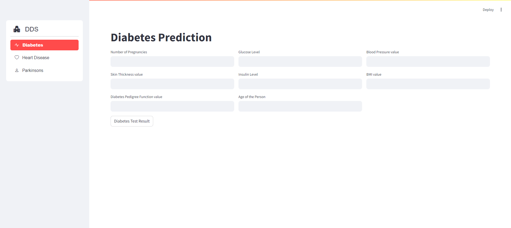

# Diseases Detection System (DDS)

## Project Overview
The Diseases Detection System (DDS) is a state-of-the-art tool designed to support healthcare professionals in Bangladesh by enabling precise and swift disease diagnoses through data-driven insights. By integrating with local health databases and utilizing machine learning, DDS aims to address the unique health challenges faced in the region.

## Key Features
- **Localized Data Processing:** Tailored to handle and analyze health data specific to the Bangladeshi population.
- **Integration with National Health Systems:** Designed to seamlessly integrate with Bangladesh’s health infrastructure, including both public and private health services.
- **Real-Time Analytics:** Offers real-time data processing to support urgent healthcare decisions.

## Objectives

The primary objectives of the DDS project are:
- To develop a robust and scalable system for disease detection.
- To integrate multiple data sources for comprehensive analysis.
- To employ machine learning algorithms for accurate prediction of disease outbreaks.
- To provide actionable insights for public health officials and policymakers.

## Methods

The DDS project utilizes a combination of data collection, preprocessing, and machine learning techniques to achieve its objectives. Key methodologies include:
- **Data Collection:** Aggregating data from various sources such as health records, environmental data, and social media.
- **Data Preprocessing:** Cleaning and transforming the data to ensure quality and consistency.
- **Machine Learning:** Implementing algorithms such as decision trees, random forests, and neural networks for disease prediction.
- **Validation:** Evaluating the performance of the models using metrics like accuracy, precision, and recall.

## DDS Interface 
This project is ongoing and continuously adds new disease detection systems.

